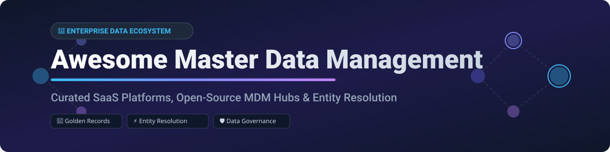

  

# 🏢 Awesome Master Data Management (MDM) 🚀

  
  
  
  

> A comprehensive, SEO-optimized, and curated collection of **Master Data Management (MDM)** SaaS enterprise platforms, open-source MDM hubs, identity/entity resolution libraries, and data quality tools. Designed for data architects, data stewards, and enterprise governance leaders creating golden records across multi-domain ecosystems. 🌐✨

---

## 📚 Table of Contents
- [📊 Market Overview & Industry Dynamics](#-market-overview--industry-dynamics)
- [💼 SaaS & Commercial MDM Platforms](#-saas--commercial-mdm-platforms)
- [🔓 Open-Source MDM Hubs & Entity Resolution](#-open-source-mdm-hubs--entity-resolution)
- [🤝 How to Contribute](#-how-to-contribute)
- [💖 Support & Sponsorship](#-support--sponsorship)
- [⚠️ Disclaimer](#-disclaimer)
- [📈 Star History](#-star-history)

---

## 📊 Market Overview & Industry Dynamics

> **Market Size & Valuation**: The global Master Data Management (MDM) market is estimated at **~$3.8 Billion to $5.2 Billion** (2025–2026) and is projected to expand to over **$11 Billion+ by 2030** at a Compound Annual Growth Rate (CAGR) of **~15.5%**.  
> **Market Fragmentation**: The enterprise MDM sector is **moderately concentrated** at the top tier among established legacy tech giants and cloud-native category leaders (such as Informatica, SAP, Reltio, and Profisee), but remains **moderately fragmented** overall due to the rapid growth of specialized entity resolution engines, Product Information Management (PIM) tools, and emerging open-source data quality stacks.

---

## 💼 SaaS & Commercial MDM Platforms

The following enterprise platforms provide multi-domain data hubs, automated AI matching, survivorship rules, data stewardship interfaces, and compliance frameworks. Sorted by **Company Size / Revenue / Valuation (Descending)**:

| 🏢 Platform / Vendor | 💰 Estimated Company Size (Revenue / Valuation) | 💵 Starting Tier Pricing | 🎁 Free Tier Limit / Free Trial | 🎯 Key Capabilities & Focus |
| :--- | :--- | :--- | :--- | :--- |
| **[Informatica MDM](https://www.informatica.com/)** 🏢 | **~$7.64B Market Cap** (~$1.68B Revenue) | Custom enterprise quote (IPU consumption-based starting ~$10,000+/mo) | 30-Day Free Trial (Cloud Data Integration & IDMC modules) | Intelligent Data Management Cloud (IDMC), enterprise multi-domain MDM, automated matching, data governance. |
| **[Reltio](https://www.reltio.com/)** ☁️ | **~$1.7B Valuation** (~$115M+ ARR; Acquired by SAP) | Custom enterprise quote (Velocity packs start ~$3,000–$5,000/mo) | 30-Day Guided Test Drive (Reltio Velocity Packs) | Cloud-native multi-domain MDM, real-time entity resolution, graph relationship management, clean room capabilities. |
| **[Ataccama ONE](https://www.ataccama.com/)** ⚡ | **~$61.3M Revenue** ($150M Bain Capital Growth Funding) | Custom modular quote (Based on users/managed objects starting ~$2,500/mo) | Guided Interactive Product Demo & Sandbox Access | AI-driven data management, integrated MDM, data quality validation, automated stewardship. |
| **[Semarchy xDM](https://www.semarchy.com/)** 🧠 | **~$20.6M ARR** (~$105.6M Estimated Valuation) | Custom pricing quote (App-based licensing starting ~$2,000/mo) | 30-Day Full Platform Free Trial (Cloud or On-Premise) | Intelligent Data Hub, rapid multi-domain MDM deployment, data stewardship, built-in governance. |
| **[Profisee](https://profisee.com/)** 🚀 | **~$19M ARR** (37% ARR CAGR Growth) | Custom quote (Tiered by record volume & domains, starting ~$2,500/mo) | Free Guided Live Demo & 14-Day Azure/Fabric Partner Trial | Enterprise MDM optimized for Microsoft Azure/Fabric ecosystem, fast time-to-value, golden record mastering. |

---

## 🔓 Open-Source MDM Hubs & Entity Resolution

Open-source Master Data Management systems and core entity resolution engines enable custom golden-record hubs, identity matching, and data cleansing without expensive licensing.

Sorted by **GitHub Stars_Count (Descending)**:

*  **[Great Expectations](https://github.com/great-expectations/great_expectations)** 🧪  
  The leading open-source Python framework for data quality validation, profiling, and metadata documentation—essential for pre-cleansing data before loading into MDM hubs.

*  **[Amundsen](https://github.com/amundsen-io/amundsen)** 🔍  
  Open-source data discovery and metadata engine (originally built by Lyft) that documents data lineage, ownership, and entity schemas alongside MDM platforms.

*  **[Dedupe](https://github.com/dedupeio/dedupe)** 🤖  
  Python library using machine learning and active learning to perform fuzzy matching, record linkage, and entity deduplication for master record creation.

*  **[Pimcore](https://github.com/pimcore/pimcore)** 📦  
  Open-source data and experience management platform combining Product Information Management (PIM), MDM, Digital Asset Management (DAM), and Customer Data Platform (CDP) capabilities.

*  **[Splink](https://github.com/moj-analytical-services/splink)** ⚡  
  Fast probabilistic data linkage and entity resolution library running on DuckDB and Apache Spark, executing Fellegi-Sunter matching at massive scale.

*  **[Zingg](https://github.com/zinggAI/zingg)** 🎯  
  Open-source ML-based entity resolution and identity matching platform built for Apache Spark, connecting customer and product records across enterprise data warehouses.

*  **[AtroCore](https://github.com/atrocore/atrocore)** 🌐  
  Flexible open-source business application software offering modular Master Data Management (MDM), PIM, and DAM with customizable entity models and data stewardship workflows.

*  **[Fuyuko](https://github.com/tmjeee/fuyuko)** ❄️  
  Open-source Master Data Management and Product Information Management application tailored for managing complex product attributes and master entity definitions.

*  **[Yugandhar Open MDM Hub](https://github.com/yugandharproject/yugandhar-open-mdmhub)** 🏛️  
  Service-oriented open-source Customer Data Integration (CDI) and MDM hub built with Java Spring/Hibernate, featuring pre-configured microservices for enterprise master data.

---

## 🤝 How to Contribute

Contributions are welcome! Help us keep this Master Data Management ecosystem resource accurate and up to date. 🛠️

1. **Fork** the repository 🍴
2. **Create** a new branch (`git checkout -b feature/add-mdm-tool`) 🌿
3. **Add** your tool to the table or list with factual descriptions 📝
4. **Submit** a Pull Request with a short overview 🚀

---

## 💖 Support & Sponsorship

If you find this repository helpful for your data architecture, governance, or master data management research, please consider supporting the project:

- ⭐ **Star** this repository to increase its visibility!
- 🔀 **Fork** and share it with your network or data engineering team.
- ☕ **Buy me a coffee**: Support ongoing open-source curation via [GitHub Sponsors](https://github.com/sponsors/ishandutta2007).

Thank you for your support and contributions to the open data community! ❤️

---

## ⚠️ Disclaimer

This repository is a community-curated list intended for informational and educational purposes. Product names, logos, and brands belong to their respective owners. Evaluators should conduct independent technical benchmarking and commercial due diligence before selecting MDM or entity resolution tools.

---

## 📈 Star History

---

  Made with ❤️ for Data Architects, Data Stewards, and Governance Leaders worldwide.

